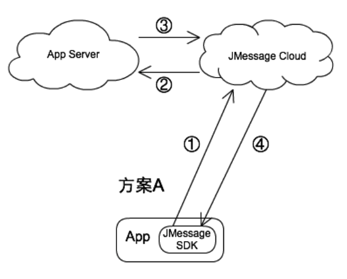
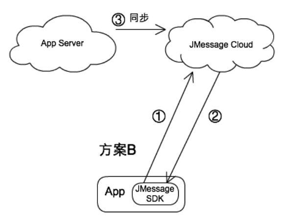
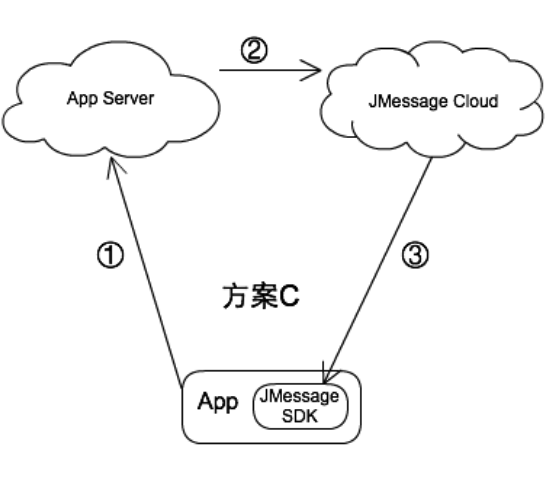
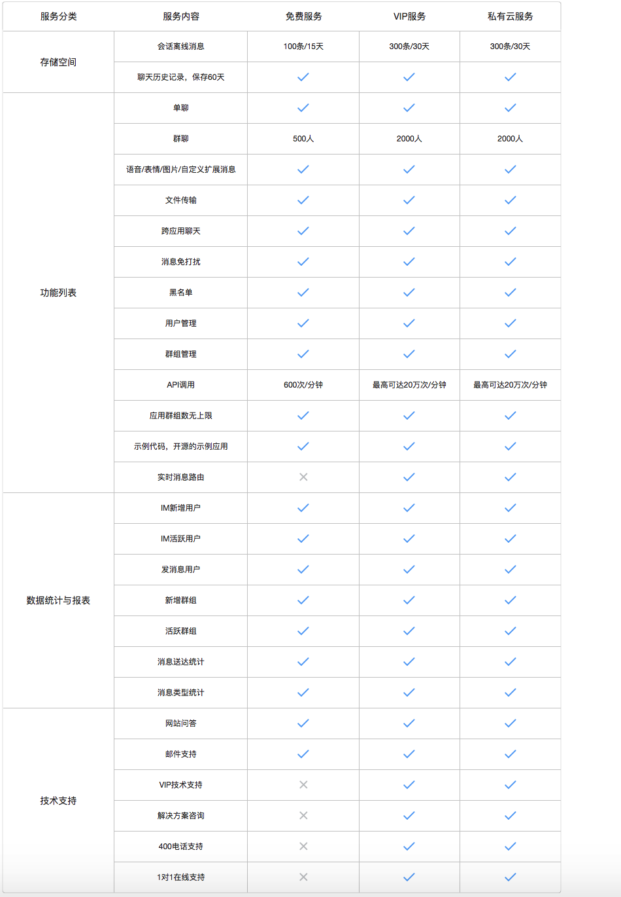
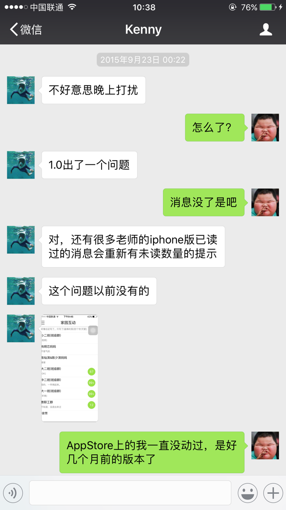
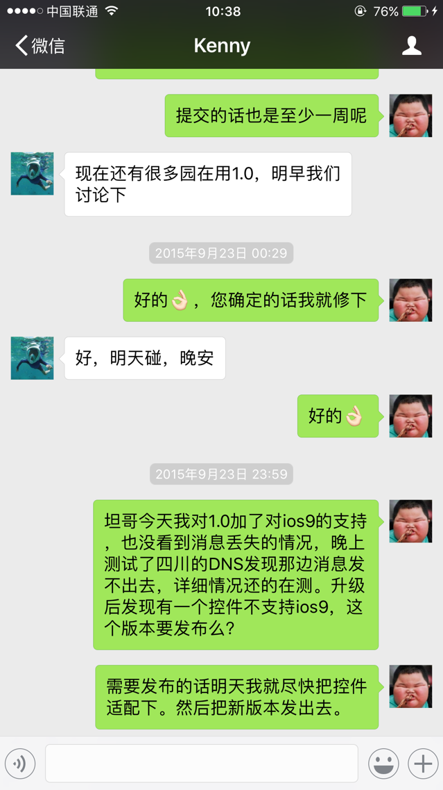

#关于极光IM做为公司产品IM功能研究报告

## 极光IM解决方案

#### 方案A

* 1.SDK提交到JMessage
* 2.JMessage调用App Server提供的callback接口
* 3.App Server确认要发消息
* 4.JMessage下发消息给B

- 说明
 + 好处:开发可控性好
 + 坏处:整个流程太麻烦, callback有一定的工作量
 + 总结:不建议这种费力不讨好的行为.

#### 方案B

* 1.SDK提交到JMessage
* 2.JMessage下发消息给B
* 3.公司自己服务器定时同步消息记录

- 说明
 + 好处:开发相对时间短,省钱
 + 坏处:需要第三步接口提供消息同步,从而做数据保存和分析
 + 总结:建议试用

#### 方案C

* 1.App提交到App Server
* 2.App Server发消息给B

- 说明
 + 好处:开发可控性好
 + 坏处:开发工作量大,服务器压力也大,API每分钟600次就会挂掉
 + 总结:不建议这种费力不讨好的

